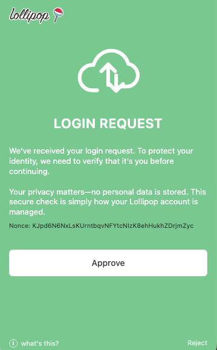
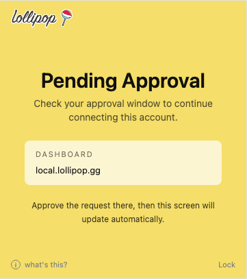

# Approve or reject requests

Lollipop pages can send sign-in or signing requests to the Authenticator.

Read the request carefully before approving. If you do not recognize the request, click **Reject**.

## Approval request

The request screen shows the action being requested and gives you the choice to approve or reject it.

## Pending approval

Sometimes the Lollipop page will show a pending approval state while the Authenticator request is open.

The pending screen waits for you to approve the request from the Authenticator window.

After you approve, the page should update automatically.

## Locked before approval

Some requests may require you to unlock first. Unlock with your local password, then continue with the approval flow.
