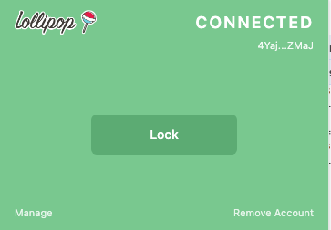

# Connect to Lollipop

The Authenticator connects through Lollipop pages.

Open a Lollipop page, then open the Authenticator and click **Connect**.

## Disconnected state

The disconnected home screen shows the Connect button when the site is not connected yet.

## Connected state

The connected home screen confirms the Authenticator is connected to the current Lollipop page.

## If you are not on a Lollipop page

If you open the Authenticator somewhere else, it may tell you to open your Lollipop dashboard first.

This screen appears when the Authenticator needs a Lollipop page to continue.
