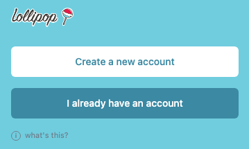
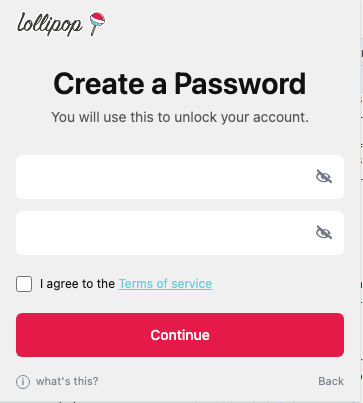
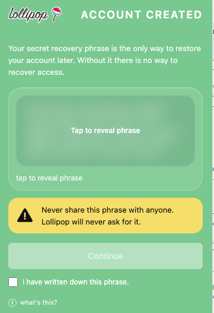

# Create a new account

Use this flow if you are setting up Lollipop Authenticator for the first time.

## Start from the welcome screen

Click **Create a new account**.

The welcome screen is where new users begin account setup.

## Create a local password

Enter a password, confirm it, agree to the Terms of Service, then click **Continue**.

This password unlocks your account on this browser and device.

Your password is local to this browser. There is no password recovery flow. If you forget it, you will need your secret recovery phrase to restore the account.

## Finish account creation

After the account is created, the Authenticator will show your secret recovery phrase backup step.

This screen explains that your recovery phrase is the only way to restore your account later.

Do not continue until you have saved your secret recovery phrase somewhere safe.
