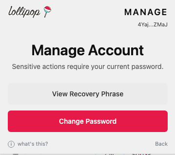
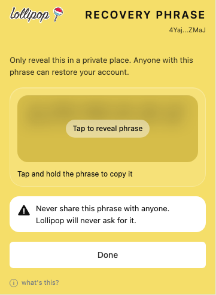
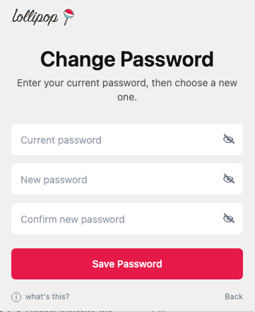

# Manage your account

Open **Manage** to view sensitive account options.

The Manage screen lets you view your recovery phrase or change your password.

## View your recovery phrase

Click **View Recovery Phrase**. You will be asked to verify your current password first.

Password verification protects sensitive account actions.

After verification, reveal the phrase only in a private place.

Anyone with this phrase can restore and control the same account.

## Change your password

Click **Change Password**, enter your current password, then choose a new password.

Changing your password updates the local password for this browser and device.

Your secret recovery phrase does not change when you change your password.
