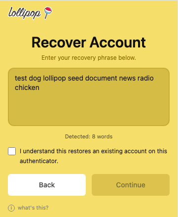

# Recover an existing account

Use this flow if you already have a Lollipop account and want to restore it in this browser.

## Start recovery

From the welcome screen, click **I already have an account**.

The welcome screen lets existing users start account recovery.

## Enter your recovery phrase

Enter your 12-word or 24-word secret recovery phrase in the original order.

The recovery screen detects how many words you have entered.

Check the confirmation box, then continue.

If the words are missing, misspelled, or out of order, the account cannot be restored.
