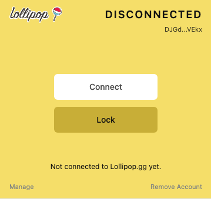

# Troubleshooting

## I forgot my password

There is no password recovery flow. Start over and recover the account using your secret recovery phrase.

If you lost both your password and your secret recovery phrase, the account cannot be recovered.

## I am not on a Lollipop page

The Authenticator only connects through Lollipop pages. Open your Lollipop dashboard or another Lollipop page, then try again.

This screen appears when the Authenticator needs a Lollipop page to continue.

## The request window disappeared

Open the Authenticator again from the Chrome toolbar. If the request is still active, it should be available there.

If it is gone, return to the Lollipop page and start the action again.

## The extension says the request is no longer available

The request may have expired, been rejected, or been replaced by a newer request. Return to the Lollipop page and try again.

## The site is not connected yet

Open the Authenticator while on a Lollipop page and click **Connect**.

The disconnected state shows the Connect button.

## I recovered my account but it is locked

Unlock it with the local password you created during recovery.
