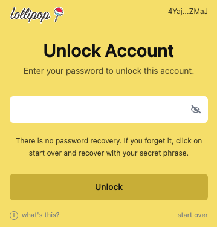

# Unlock your account

The Authenticator may ask you to unlock before connecting, approving a request, viewing your recovery phrase, or changing your password.

Enter your local password, then click **Unlock**.

The unlock screen protects your saved account on this browser.

The Authenticator may lock again after inactivity or when you manually lock it.

## If you forgot your password

There is no password recovery flow. Click **start over** and recover the account with your secret recovery phrase.
