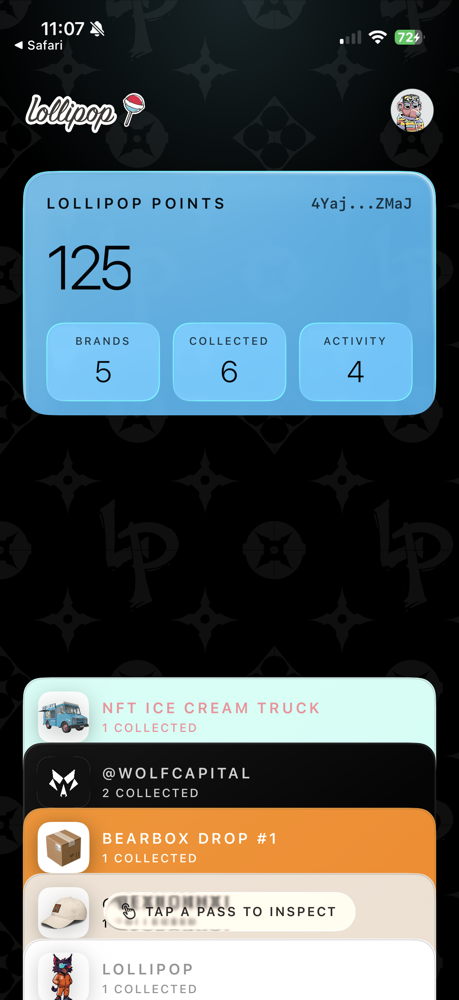

# Overview

The Lollipop iOS app helps you use your Lollipop account on iPhone. You can create or recover your account, unlock the app, manage your profile and Lollipop Link, claim eligible products and rewards, view your collection, and check account details on this device.

## Start here

* [Getting Started](getting-started.md)
* [Sign In](sign-in.md)
* [Create or Edit Your Profile](create-edit-profile.md)
* [Manage Your Lollipop Link](manage-lollipop-link.md)
* [Claim Products and Rewards](claim-products-rewards.md)
* [Your Collection](collection.md)
* [Troubleshooting](troubleshooting.md)
* [Security and Privacy](security-privacy.md)

## Documentation status

This section is being expanded as more iOS app features are documented.

*
* The main account, profile, claim, rewards, collection, and settings flows are documented below.
* The [Cards and Tags](/broken/pages/NQWg99z8z318nHNDdVRa) page is still a placeholder while that part of the app is reviewed further.
* Screenshot placeholders are intentionally visible until final iPhone screenshots are added.

<figure><figcaption></figcaption></figure>

