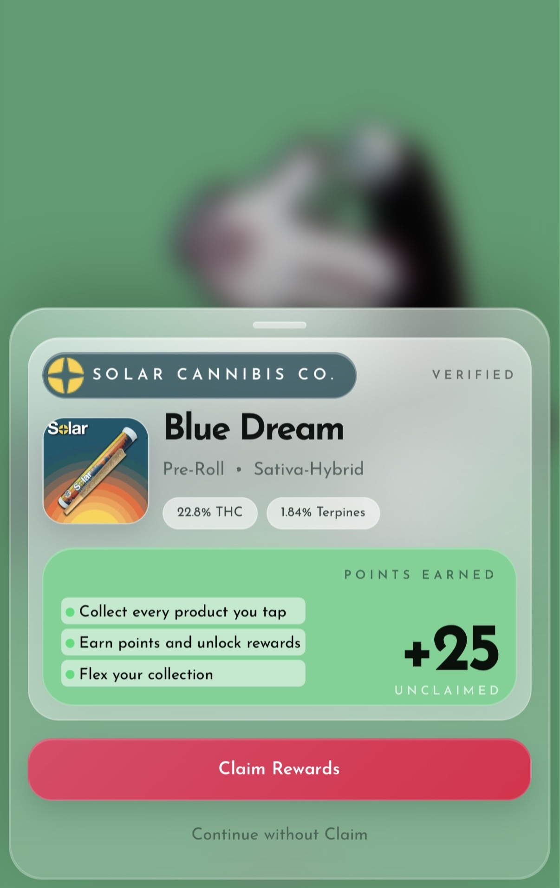

# Claim Products and Rewards

When you tap a Lollipop-enabled product, card, or tag, the iPhone app can open a claim flow. That flow helps you save the verified item to your account and, when available, add reward points too.

## What usually happens after a tap

1. Tap the Lollipop-enabled product, card, or tag with your iPhone.
2. The app opens a claim drawer.
3. The app loads a preview of the item.
4. If the item includes points, the preview may show the points amount.
5. If you are not signed in, the app shows **Log In to Claim** or **Create Account to Claim**.

<figure><figcaption></figcaption></figure>

## Claim an item or reward

1. Open the claim preview.
2. Sign in, recover, or unlock your account if the app asks you to.
3. Tap the claim button shown on screen.
4. If **Approve Claim** appears, read it carefully and approve only if the request matches what you just tapped.
5. Wait for the success screen.
6. Tap **View Item** to open the item in your collection.

> Important: Only approve a claim you expected. If the request looks unfamiliar, stop and do not approve it.

<figure><figcaption></figcaption></figure>

\[Screenshot needed: claim approval or loading state that leads into Approve Claim]

## If the claim succeeds

After a successful claim:

* The item is added to your collection.
* Any awarded points can be added to your account.
* **View Item** opens the claimed item from the home collection view.

<figure><figcaption></figcaption></figure>

## If the item was already claimed

The app can show **Already Claimed** with a message that the item has already been added to a Lollipop account.

* You will not be able to claim the same item again to the same or another account through this flow.
* Tap **Done** to close the message.

<figure><figcaption></figcaption></figure>

## If a claim fails

1. Tap **Try Again** if the app offers it.
2. If the message says the claim expired, tap the physical item again to start a fresh claim.
3. Make sure you are on the correct account before retrying.
4. Check your internet connection.
5. Reopen the app and tap the item again if needed.

The app can show messages such as:

* **This claim expired**
* **We couldn’t load this claim**
* **Approval failed**
* **This item has already been added to a Lollipop account.**

<figure><figcaption></figcaption></figure>
