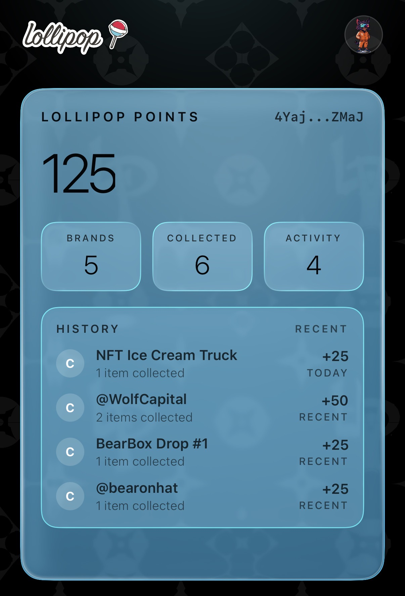

# Rewards and Points

Rewards and points are account benefits tied to eligible Lollipop products and taps.

## What rewards and points are

* Some items award points when you claim them.
* Some taps only add the item to your collection and do not add points.
* The exact rules depend on the product you tapped.

> Tip: If a claim includes points, the claim preview usually shows the amount before you approve it.

## How you may earn points

1. Tap an eligible Lollipop product, card, or tag.
2. Open the claim flow.
3. Complete the claim on the correct account.
4. Wait for the success screen.

If points are part of that item, they can be added during the same claim flow.

## Where points appear in the app

On the home screen, the app shows a **LOLLIPOP POINTS** card.

* The large number is your current point balance.
* The card also shows **Brands**, **Collected**, and **Activity** totals.

Tap the points card to open the larger points view. If history is available, the expanded card can show **HISTORY** and **RECENT** entries.

<figure><figcaption></figcaption></figure>

## What points do not tell you

The current iOS app shows your point balance and recent activity, but this documentation does not list redemption rules yet.

If Lollipop adds more points details in the app later, this page will be expanded.
